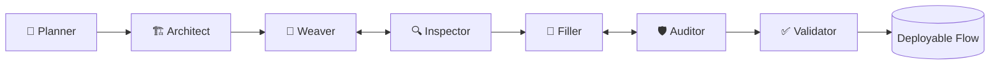

<div align="center">


[](https://git.io/typing-svg)

<a href="https://arunaddagatla.vercel.app/"></a>
<a href="https://www.linkedin.com/in/arun-addagatla"></a>
<a href="https://arunaddagatla.medium.com/"></a>
<a href="mailto:arun.a.addagatla@gmail.com"></a>
<a href="https://github.com/arun2728"></a>

</div>

---

## `~/whoami`

```ts
const arun = {
  role: "Founding AI Engineer @ Lamatic.ai",
  focus: ["agent runtimes", "multi-agent orchestration", "production LLM ops"],
  building: "infrastructure for durable autonomous systems — not slide-deck demos",
  firstHire: true,          // shipped 80%+ of the core platform
  stack: ["Python", "TypeScript", "Go", "Cloudflare Workers", "Kubernetes"],
  caresAbout: ["durability", "distributed execution", "eval", "what breaks after the millionth run"],
};
```

I'm **Arun Addagatla**, an AI systems engineer who builds the runtime glue that keeps agents alive past a single HTTP request — serverless execution, multi-agent orchestration, memory/RAG layers, and eval. As the first engineering hire at **[Lamatic.ai](https://lamatic.ai)** (TechCrunch Startup Battlefield 200 · Cloudflare Workers Launchpad), I've shipped over **80%** of the platform.

---

## 🛠️ Flow-Gen Agent Harness — _the thing I'm proudest of_

A **multi-agent harness** that turns a plain-English request into a validated, deployable Lamatic workflow. I first built a reusable multi-agent node primitive, then **dogfooded it** to build the harness itself.



| Agent | Role |
|-------|------|
| **Planner** | Resolves intent · RAG over sample flows · single vs. multi-workflow |
| **Architect** | Selects nodes from the catalog |
| **Weaver ⇄ Inspector** | Builds skeleton/edges · edge dry-run with feedback loop |
| **Filler ⇄ Auditor** | Fills node config from schema · executes node + credential check with feedback loop |
| **Validator** | Final end-to-end retest → hands the user a working flow |

**Two-tier verification:** deterministic checks where ground truth exists; a rubric **LLM-as-a-judge** only for fuzzy output quality — and the judge *never* overrides a hard check.

---

## 🚀 Featured Work

### 🧩 [Content OS](https://github.com/arun2728/content-os) &nbsp;·&nbsp; _in development_
AI content-orchestration monorepo guiding the full pipeline — **clarify → outline → write → edit → publish** — with autonomous agents owning each stage.

### 🔌 [Dev.to MCP Server](https://github.com/arun2728/dev-to-mcp) &nbsp;·&nbsp; _live_
An MCP server exposing **35+ tools** over the Dev.to (Forem) API. Lets Claude & Cursor draft, edit, publish, and manage content. Supports **stdio · Streamable HTTP · Cloudflare Workers** transports, with a multi-arch Docker image on GHCR.

### 🤖 [jobapply](https://github.com/arun2728/jobapply) &nbsp;·&nbsp; _open source_
Local CLI that searches jobs, dedupes across runs, and drafts structured resumes + cover letters from your base profile using **LangGraph** agents — with checkpointing, optional PDF export, and pluggable models (Gemini, Anthropic, OpenAI, Ollama).

### 🧪 [LLMQuests](https://github.com/arun2728/LLMQuests) &nbsp;·&nbsp; _open source_
Hands-on collection of LLM & agent experiments — implementations and deep-dives that back my writing on memory, RAG, MCP, and multi-agent systems.

### 🎙️ Multilingual Indian Voicebot &nbsp;·&nbsp; _freelance_
End-to-end voice assistant across **10+ Indian languages**. Conformer S2T on Triton, Fastpitch TTS, and a LangChain RAG pipeline with embedding + reranker models.

---

## 💼 Experience

**`Lamatic.ai` — Founding Engineer, AI** · _Mar 2024 – Present · Miami, FL (remote)_
- Built **80%+** of the core stack as the first engineering hire — AI systems, backend, infra, and critical frontend.
- Architected a serverless **executor** at **1M+ monthly runs** and a deployment engine at **1K+ deploys/min**.
- Cut deployment latency **2 min → 15 s** (~**87%**).
- Built the **flow-gen multi-agent harness** and a configurable **LLM-as-a-judge** eval framework.
- Shipped an internal **hiring agent** (resume parsing + video analysis) cutting recruiter workload **70%**.
- Engineered secure VPC **Kubernetes ETL** for Drive/S3/SharePoint with OAuth, **Semantic RAG**, a **Multi-Agent Supervisor**, Slack/Teams webhooks, and a **native GitHub VCS** for flow sync.

**`Samespace` — SDE, AI/ML** · _Oct 2022 – Mar 2024 · Mumbai_
- Chat/voicebots handling **95%** of queries (embeddings, reranking, tuned Zephyr & GPT-4).
- Fine-tuned **Mistral / LLaMA-2** with LoRA/PEFT (+30% fluency); LLM inference engine at **106 tok/s**.
- Optimized **Whisper V3** with ONNX/TensorRT + Triton → **0.1–0.4s** latency; multimodal search (+60%).

**`Enterpret` — ML Intern, NLP** · _Sep 2021 – Aug 2022 · Bangalore_
- Serverless multilingual sentiment on AWS (−50% processing time); CI/CD; NER/classification (+30%); anomaly detection (−60% false positives).

**`Algoritmo Labs` — Data Science Intern** · _2020_ — ML model → ONNX → **Go** runtime for client-side deployment.

---

## 🧰 Toolbox

**Languages**


**Web & Backend**


**AI / LLM / ML**


**Inference & Model Serving**


**Data & Vector Stores**


**Cloud & Infra**

-232F3E?style=flat-square&logo=amazonwebservices&logoColor=white)
-4285F4?style=flat-square&logo=googlecloud&logoColor=white)
-F38020?style=flat-square&logo=cloudflare&logoColor=white)


**Observability & CI/CD**


---

## 🎤 Talks & ✍️ Writing

**Recent talks**
- **Why LLMs Need Memory** — Lamatic Community (Mar 2026) · [YouTube](https://www.youtube.com/watch?v=iwrBZWDOnSo)
- **Applications of AI** — Omkaranada Institute (Apr 2026) · live-shipped a web app in <8 min
- **Why Prompting Isn't Enough: The Case for RAG** — Lamatic Community (Jan 2026)
- **What is MCP & How It Works** — Daytona Developers Club Tour '25, Mumbai (May 2025)

**Recent writing** (70k+ reads across Medium · GoPenAI · Nerd For Tech · [Lamatic Labs](https://labs.lamatic.ai/authors/arun-addagatla))
- [Why LLMs Need Memory — Building AI Agents Hands-On](https://medium.com/@arunaddagatla/why-llms-need-memory-building-ai-agents-with-a-hands-on-implementation-849dbbf6fd0d) · Mar 2026
- [Inside NVIDIA Nemotron 3: Hybrid MoE for Multi-Agent AI](https://medium.com/gopenai/inside-nvidia-nemotron-3-hybrid-moe-models-built-for-multi-agent-ai-2aabcc056e93) · Dec 2025
- [Cut Token Costs by 60%: TOON vs JSON for AI Workflows](https://medium.com/@arunaddagatla/cut-token-costs-by-60-how-toon-outperforms-json-for-ai-workflows-cf67d038db2d) · Nov 2025
- [Lamatic — The Operating System for AI Agents](https://labs.lamatic.ai/p/lamatic-ai-the-operating-system-for-ai-agents)

---

## 🔭 Currently

Building reliable **GenAI + Agentic AI** for enterprise · durable **execution/inference** platforms · production **MLOps** · **RAG**, **MCP** integrations, and autonomous workflow automation.

---

<div align="center">

### 📊 GitHub


<br><br>


<br><br>


</div>

---

<div align="center">

### ✨ _"Build useful AI. Ship it fast. Scale it responsibly."_ ✨


</div>
